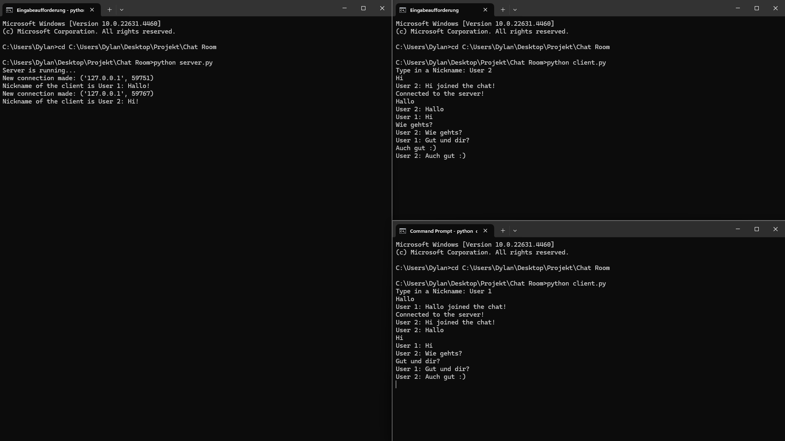

# Chat Server and Client

This project contains a basic chat server and client application implemented using Python's `socket` and `threading` modules. It allows multiple clients to connect to a server and exchange messages in real-time.



## Features
- **Server**:
  - Listens for incoming client connections on a specific IP and port.
  - Each client is assigned a unique nickname.
  - Broadcasts messages from any client to all other connected clients.
  - Handles client disconnections and broadcasts when a client leaves the chat.

- **Client**:
  - Connects to the server and sends messages with a nickname.
  - Listens for incoming messages from the server and displays them.
  - Allows the user to send messages to the server.

## Requirements
- Python 3.x
- No external libraries are required as the application uses Python’s built-in `socket` and `threading` modules.

## Setup

### 1. Running the Server
To run the server, create a Python file (e.g., `server.py`) and copy the server code into it. The server will listen on `localhost` (127.0.0.1) and port `44444` by default. To start the server, simply run the following command:

```bash
python server.py
```

# Running the Client

To run the client, create a Python file (e.g., `client.py`) and copy the client code into it. The client will prompt for a nickname and then connect to the server running on `127.0.0.1` on port `44444`. To start the client, simply run the following command:

```bash
python client.py
```
# Multiple Clients

You can run multiple instances of the client to simulate multiple users. Each client will be able to send messages to the server, and the server will broadcast those messages to all connected clients.

## Code Explanation

### Server Code

- **Socket Setup**: The server creates a socket using `socket.AF_INET` (IPv4) and `socket.SOCK_STREAM` (TCP).
- **Broadcast Function**: The `broadcast()` function sends a message to all connected clients.
- **Handle Function**: This function continuously listens for messages from a client and calls `broadcast()` to forward the message to other clients. If a client disconnects, it removes the client from the `clients` list and sends a notification to other clients.
- **Receive Function**: This function accepts new client connections, assigns nicknames, and starts a new thread for each client to handle their messages.

### Client Code

- **Nickname Prompt**: The client asks the user to input a nickname upon starting.
- **Receive Function**: This function listens for messages from the server and prints them to the console.
- **Write Function**: This function allows the user to input a message, which is then sent to the server.

## Example of Interaction

### Server Output:

```bash
Server is running...
New connection made: ('127.0.0.1', 50000)
Nickname of the client is Alice!
Alice joined the chat!
```

### Client Output:

```bash
Type in a Nickname: Alice
Connected to the server!
Alice: Hello, everyone!
```

### Broadcast Message:

```bash
Bob: Hello, Alice!
```

## Troubleshooting

- **Client Disconnects**: If a client disconnects unexpectedly, the server will display an error message and close the connection properly.
- **Server not Running**: If you are unable to connect to the server, ensure that the server is running and the correct port (44444) is open.
